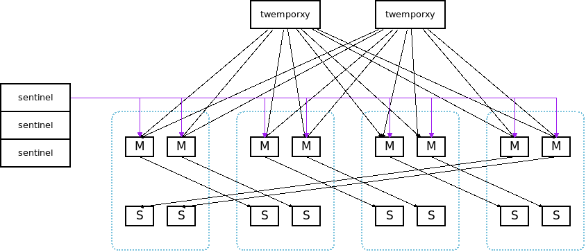

deploy.py
=========

this script will deploy a redis cluster with:

- redis
- redis-sentinel
- twemproxy

you can deploy/start/stop/run_rediscmd/get status/reconfig proxy ... 

config
------

::

    cluster0 = {
        'cluster_name': 'cluster0',
        'user': 'ning',
        'redis': [
            # master host:port, install path         # slave
            ('127.0.0.5:20000', '/tmp/redis-20000'), ('127.0.0.5:30000', '/tmp/redis-30000'), 
            ('127.0.0.5:20001', '/tmp/redis-20001'), ('127.0.0.5:30001', '/tmp/redis-30001'),
        ],
        'sentinel':[
            ('127.0.0.5:21001', '/tmp/sentinel-21001'),
            ('127.0.0.5:21002', '/tmp/sentinel-21002'),
            ('127.0.0.5:21003', '/tmp/sentinel-21003'),
        ],
        'nutcracker': [
            ('127.0.0.5:22000', '/tmp/nutcracker-22000'),
            ('127.0.0.5:22001', '/tmp/nutcracker-22001'),
            ('127.0.0.5:22002', '/tmp/nutcracker-22002'),
        ],
    }

this will gen ``sentinel``  config::

    sentinel monitor cluster0-20000 127.0.0.5 20000 2
    sentinel down-after-milliseconds  cluster0-20000 60000
    sentinel failover-timeout cluster0-20000 180000
    sentinel parallel-syncs cluster0-20000 1
            
    sentinel monitor cluster0-20001 127.0.0.5 20001 2
    sentinel down-after-milliseconds  cluster0-20001 60000
    sentinel failover-timeout cluster0-20001 180000
    sentinel parallel-syncs cluster0-20001 1

and ``twemproxy`` config::

    cluster0:
      listen: 127.0.0.5:22000
      hash: fnv1a_64
      distribution: modula
      preconnect: true
      auto_eject_hosts: false
      redis: true
      backlog: 512
      client_connections: 0
      server_connections: 1
      server_retry_timeout: 2000
      server_failure_limit: 2
      servers:
        - 127.0.0.5:20000:1 cluster0-20000
        - 127.0.0.5:20001:1 cluster0-20001

usage
-----

::

    $ ./bin/deploy.py -h
    usage: deploy.py [-h] [-v] [-o LOGFILE] clustername op [cmd]

    positional arguments:
      clustername           cluster target 
      op                    aof_rewrite     : None
                            deploy          : deploy the binarys and config file (redis/sentinel/nutcracker) in this cluster
                            kill            : kill all instance(redis/sentinel/nutcracker) in this cluster
                            log             : show log of all instance(redis/sentinel/nutcracker) in this cluster
                            master_memory   : show used_memory_human:1.53M
                            master_qps      : instantaneous_ops_per_sec:4
                            mastercmd cmd   : run redis command against all redis Master instance, like 'INFO, GET xxxx'
                            monitor         : monitor status of the cluster
                            printcmd        : print the start/stop cmd of instance
                            rdb             : do rdb in all redis instance
                            reconfig_proxy  : None
                            rediscmd cmd    : run redis command against all redis instance, like 'INFO, GET xxxx'
                            start           : start all instance(redis/sentinel/nutcracker) in this cluster
                            status          : get status of all instance(redis/sentinel/nutcracker) in this cluster
                            stop            : stop all instance(redis/sentinel/nutcracker) in this cluster
      cmd                   the redis/ssh cmd like "INFO"

start cluster::

    $ ./bin/deploy.py cluster0 deploy

    $ ./bin/deploy.py cluster0 start
    2013-12-26 14:47:47,385 [MainThread] [NOTICE] start redis
    2013-12-26 14:47:47,622 [MainThread] [INFO] [redis:127.0.0.5:20000] start ok in 0.23 seconds
    2013-12-26 14:47:47,848 [MainThread] [INFO] [redis:127.0.0.5:21000] start ok in 0.22 seconds
    2013-12-26 14:47:48,099 [MainThread] [INFO] [redis:127.0.0.5:20001] start ok in 0.24 seconds
    2013-12-26 14:47:48,369 [MainThread] [INFO] [redis:127.0.0.5:21001] start ok in 0.27 seconds
    2013-12-26 14:47:50,788 [MainThread] [NOTICE] start sentinel
    2013-12-26 14:47:51,186 [MainThread] [INFO] [sentinel:127.0.0.5:29001] start ok in 0.39 seconds
    2013-12-26 14:47:51,452 [MainThread] [INFO] [sentinel:127.0.0.5:29002] start ok in 0.26 seconds
    2013-12-26 14:47:51,820 [MainThread] [INFO] [sentinel:127.0.0.5:29003] start ok in 0.35 seconds
    2013-12-26 14:47:51,820 [MainThread] [NOTICE] start nutcracker
    2013-12-26 14:47:52,082 [MainThread] [INFO] [nutcracker:127.0.0.5:22000] start ok in 0.26 seconds
    2013-12-26 14:47:52,364 [MainThread] [INFO] [nutcracker:127.0.0.5:22001] start ok in 0.28 seconds
    2013-12-26 14:47:52,573 [MainThread] [INFO] [nutcracker:127.0.0.5:22002] start ok in 0.21 seconds
    2013-12-26 14:47:52,573 [MainThread] [NOTICE] setup master->slave
    2013-12-26 14:47:52,580 [MainThread] [INFO] setup [redis:127.0.0.5:20000]->[redis:127.0.0.5:21000]
    2013-12-26 14:47:52,580 [MainThread] [INFO] [redis:127.0.0.5:21000] /home/ning/idning-github/redis/src/redis-cli -h 127.0.0.5 -p 21000 SLAVEOF 127.0.0.5 20000
    OK
    ...

run cmd on each master::

    $ ./bin/deploy.py cluster0 mastercmd 'get "hello"'
    2013-12-24 13:51:39,748 [MainThread] [INFO] [RedisServer:127.0.0.5:20000]: get "hello"
    [RedisServer:127.0.0.5:20000] xxxxx
    2013-12-24 13:51:39,752 [MainThread] [INFO] [RedisServer:127.0.0.5:20001]: get "hello"
    [RedisServer:127.0.0.5:20001] 
    2013-12-24 13:51:39,756 [MainThread] [INFO] [RedisServer:127.0.0.5:20002]: get "hello"
    [RedisServer:127.0.0.5:20002] 
    2013-12-24 13:51:39,760 [MainThread] [INFO] [RedisServer:127.0.0.5:20003]: get "hello"
    [RedisServer:127.0.0.5:20003] world

dump rdb::

    $ ./bin/deploy.py cluster0 rdb

monitor qps/memory::

    $ ./bin/deploy.py cluster0 mq
    2013-12-24 14:21:05,841 [MainThread] [INFO] start running: ./bin/deploy.py -v cluster0 mq
    2013-12-24 14:21:05,842 [MainThread] [INFO] Namespace(cmd=None, logfile='log/deploy.log', op='mq', target='cluster0', verbose=1)
    20000 20001 20002 20003
        6     5     5     6
        6     6     5     6
        6     6     5     6
     4741     6     6     6
    33106     5     5     6
    46639     8     7     7
    42265     6     5     7

run benchmark::

    $ ./bin/deploy.py cluster_offline0 bench
    $ ./bin/deploy.py cluster_offline0 mbench

modify config::

    $ ./bin/deploy.py cluster_offline0 mastercmd ' CONFIG GET save' -v
    $ ./bin/deploy.py cluster_offline0 mastercmd 'CONFIG SET save "10000 1000000"' -v

gen_conf
========

use the config::

    BASEDIR = '/tmp/r'
    HOSTS = [
            '127.0.1.1',
            '127.0.1.2',
            '127.0.1.3',
            '127.0.1.4',
            ]
    MASTER_PER_MACHINE = 2
    SLAVE_PORT_INCREASE = 10000

it will gen the deploy.py config like this:

Dependency
==========

- pcl: https://github.com/idning/pcl

Authors
=======

- @idning
- @cen-li

